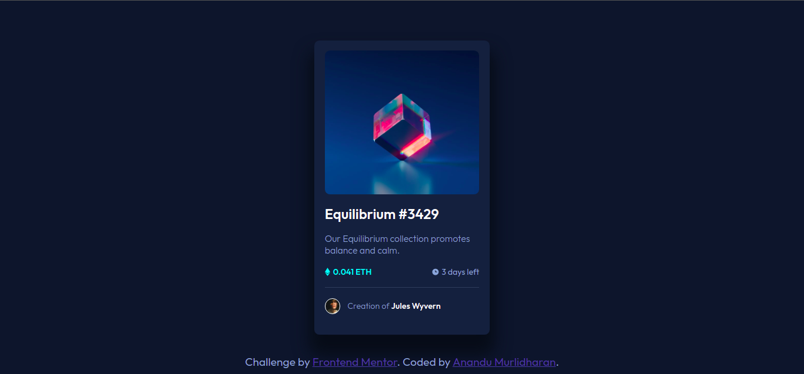
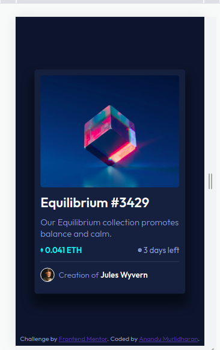

# Frontend Mentor - NFT preview card component solution

This is a solution to the [NFT preview card component challenge on Frontend Mentor](https://www.frontendmentor.io/challenges/nft-preview-card-component-SbdUL_w0U). Frontend Mentor challenges help you improve your coding skills by building realistic projects. 

## Table of contents

- [Overview](#overview)
  - [The challenge](#the-challenge)
  - [Screenshot](#screenshot)
  - [Links](#links)
- [My process](#my-process)
  - [Built with](#built-with)
  - [What I learned](#what-i-learned)
- [Author](#author)


## Overview

### The challenge

Users should be able to:

- View the optimal layout depending on their device's screen size
- See hover states for interactive elements

### Screenshot


This is the desktop version of the page.


This is the mobile version of the page.

### Links

- [Live Site URL](https://anandumurli.github.io/FrontendMentor_NFT_card/)

## My process
After analyzing the design throughly I intially created skeleton html structure of the page. I wanted to make use of flex box as a preferred styling propoerty. Hence, went with a lot of divs which will contain each and every element of the page. I chose to input the image assets, in terms of icons, profile-image and card image as a background images rather than going with an img tag. For the current project it helped me out........ i think.

After creating the skeleton, next step was to create a CSS file. In order to bring the card to the center, I went with fixing a height to the HTMl as 100vh. Then made everything else as relative to the height. This was giving body a flex and then justify-content center will essentially center any div child to the center of the whole visible screen. The last ```css .attribution div``` is made ```css position:absolute``` and hence was able to put it at the bottom wiithout affecting the structure.

The overlay, for the card-img was a thing of concern. I just created a div with class overlay inside the .card-img div. This way since the ```csss .card-img``` had fixed height and width, giving dimensions to the overlay got easier. 

### Built with

- Semantic HTML5 markup
- CSS custom properties
- Flexbox

### What I learned
I learnt how to effectively use flex box and how to work with overlays dring hover.

## Author

- Frontend Mentor - [@anandumurli](https://www.frontendmentor.io/profile/anandumurli)

